# MyCookNoteBook

[View the live project here](http://mycook-book-project.herokuapp.com/)
## Application for food lovers, who want to store and manage their recipes in one place
# Project description
“MyCookNoteBook” is a project that will allow food lovers and those who enjoy frequent cooking to create, update and store recipes with the help of the Application, which is a kind of storage or notebook for recipes for the user. 
The purpose of the application is to allow food loving users (if they saw, heard, read the recipe somewhere) write down the recipe with quick notes as well as upload an image illustrating a certain recipe, so after some time they can return to it and use it. Users have the ability to store, modify the recipe, and delete it if it is no longer needed.

In order to attract users more, the Application allows to see also the other users’ recipes and to get inspired by their choices

There are the following  categories of Users:
1.  General Users
2.  Admin (the Application Owner)

Thus, the Application will help to:
- Quickly write down favorite recipes.
- Manage recipes records: store, read, update, delete.
- Create categories and allocate recipes.
- Manage categories: store, update, delete.
- Search for recipes/categories by keywords.

# User Stories
 

## General Users
-	As a generic user, I want to easily understand the main purpose of the application due to the clear layout.
-	As a generic user, I want to be able to intuitively navigate through the application.
-	As a generic user, I want the application be responsive on all devices.
-	As a generic user, I want to be able to use the application on any device .
-	As a generic user, I want to be able to navigate the application from any kind of devices. 

## Non logged-in Users/Non-registered Users
-	As a non-logged-in user, who is a food or cook lover, I want to easily understand the main purpose of the applcation, which is providing the possibility to write down favorite recipes with quick notes as well as to manage recipes: create, update, delete.
-	As a non-logged-in user, I want to easily understand how i can start using the application.  
-	As a non-logged-in user I want to have a quick access to the recipe page.
-	As a non-logged-in user I want to be able to use the search option in order to find a recipe i want.
-   As a non-registered user, I want to easily sign up in order to start using the application.

## Logged-in Users
-	As a logged-in user I want to be redirected to my Profile page where i am greeted as a User and from where I can create new recipes or or have a quick access to the all recipes page.
-	As a logged-in user, I want to easily find out how i can put quick notes of a new recipe. 
-	As a logged-in user, I want to easily get any recipe or category by search option.
-	As a logged-in user, I want to easily find out what kind of the recipe information I can write down (The form will intuitively guide by its fileds: Name, Description, Ingredients).
-	As a logged-in user, I want to create a recipe record in the easiest way (form with drop down categories ). 
-	As a logged-in user, I want to easily cancel adding the Recipe (The button cancel below the Create recipe form).
-	As a logged-in user, I want to upload a recipe image to remember how it looks like (form with the field for the link – source from the Internet). 
-	As a logged-in user, I want to easily find out how to edit or delete the Recipe.
-	As a logged-in user, I want to easily cancel editing the Recipe (The button cancel below the Edit recipe form).
-	As a logged-in user, I want to have basic food categories to where i can allocate my recipes.

## Admin
-	As an Admin, I want to easily sign-in to the website.
-	As an Admin, I want to have access for editing/deleting any created recipe of any user. 
-	As an Admin, I want to to have access to the recipes categories with the possibility to manage them (add, edit, delete).
-	As an Admin, I want the recipes Authors to be able to manage only their own recipes (by buttons “edit”, “delete”)
-	As an Admin, I want to showcase all the created recipes to all users (to logged- or non-logged in users) 
-   As an Admin, I want to limitate non-logged in users from having access to the: vewing/managing all recipes, having search option, managing categories. (by creating error handlers and functionality in python)

# Database Model

## Collections:
1.	

2.	

3.	

# UX

The purpose of the project is to design a responsive website for all kinds of devices (mostly for the desktops and smartphones) for making navigation fast and efficient. Due to the easy navigation and laconic design of the website users should have the possibility to:
-	Clearly understand from the HOME page that the project’s purpose is to allow food loving users (if they saw, heard, read the recipe somewhere) write down the recipe with quick notes as well as upload an image illustrating a certain recipe, so after some time they can return to it and use it. Users have the ability to store, edit the recipe, and delete it if it is no longer needed.
-   Clearly understand that non-logged-in users need sign-in/sign-up first:
1. It is easy to find sign-in/sign-up options on the navigation bar.
2. If the user hits the “View all recipes” button on the Home page, it redirects them to the customized html page with a “Sorry” message and a sign-in/sign-up form.
-   When logged-in, be redirected to “My page”, from where users can be redirected to view all recipes page or create the new one with the help of “View all recipes”, “Create  new recipe” buttons or the navigation bar.
-	Clearly find out that from the navigation bar they can be redirected to the Home, Recipes, New Recipe, Sign Out options.
-	Clearly understand that on the “Recipes” page they can see all users’ recipes as well as make search for any information in recipes with the Search option.
-	Clearly understand that users can cancel searching by hitting the “Cancel” button.
-	Clearly understand that on the “Recipes” page they can manage their own recipes by using edit/delete buttons.
-	Clearly understand that editing a recipe is quick and easy due to the ability to select a category from the drop down menu, intuitively clear form input fields, form validation and ability to cancel editing.
-	Clearly understand that on the “cancel editing” option will redirect the user back to the “Recipes” page.
-	Clearly understand that on the “Recipes” page the full recipes’ description can be accesses on the pop-up card by hitting the red circle button (as well as to close the description by the red button).
-	Clearly understand that creating a new recipe option as well as vewing all recipes can be chosen from the navigation bar.
-	Clearly understand that any time users can go back to the home page by choosing “Home” from the navigation bar or logo.

## Application structure

The application consists in total of 12 visible pages, including HOME, SIGN IN, SIGN UP, SIGN OUT, RECIPES, MY PAGE, NEW RECIPE, EDIT RECIPE, MANAGE CATEGORIES, EDIT CATEGORY (for Admin only).   
 
 As well as:
1. Error handler page with the sign-in/sign-up form in case if the non-logged in user wants to access pages with all recipes, managing recipes, their profiles or search option.
2. Error handler page in case if a user is not authorized as Admin to have access to the managing categories option.
Each page is responsive and consists of the collapsible navigation menu bar with the related information and the footer with copyright and the application owner’s name.

The HOME page includes: 
-	A related to the idea background image
-	A greeting with the name of the project
-	A button “view all recipes”  

The  SIGN IN page includes:  
-	A call to action to join the project
-	A validated form with the username and password input fields
-	A sign in button
-	Possibility to be redirected to the sign up option.   

The  SIGN UP page includes:  
-	A call to action to join the project
-	A validated form with the username and password input fields
-	A sign up button
-	Possibility to be redirected to the sign in option.   

The  SIGN OUT page includes: 
-	A “See you soon” flash message
-	A call to action to join the project again
-	A validated form with the username and password input fields
-	Possibility to choose the sign in/sign up options.   

The  MY PAGE includes: 
-	A “Welcome back” flash message for signed up users
-	A greeting woth the user’s name
-	A message with the explanation what the user can do with the help of the application
-	Button: create recipes/view all recipes   

The RECIPES page includes: 
-	An explanation that here the user can find all the recipes.
-	A search option with search/reset buttons
-	All posted recipes with images, recipe name, category and author’s name and the button for opening the full recipe description in the pop-up reveal card.
-	When the reveal card is open the user sees: the recipes category, name, description, ingredients, cooking time, auther’s name, a red button on the right top for closing the full description.
-	Buttons: delete/edit (for the recipes’ author or Admin)   

The NEW RECIPE page includes: 
-	A call to action to create new recipe
-	A validated form with drop down menu for selecting categories and input fields for: recipe name, recipe description, cooking time, ingredients, loading mage.
-	Buttons to create/cancel recipe.   

The EDIT RECIPE page includes: 
-	A call to action to edit the recipe
-	A validated form with drop down menu for selecting categories and populated input fields for: recipe name, recipe description, cooking time, ingredients, loading mage. So, the user saves time by just editing the existing information.
-	Buttons to edit/cancel recipe   

When the recipes are added/edited the respective flash message appears, so the user understands that he/she successfully completed the action.   

(only for Admin) The MANAGE CATEGORIES page includes: 
-	A title
-	Cards with categories’ names and delete/edit buttons.    

(only for Admin) The EDIT CATEGORIES page includes: 
-	A title
-	An input field with the current category name
-	Buttons for cancel/edit category, which will redirect to the MANAGE CATEGORIES page.  

# Design
## Colour Scheme
-	The main colors used throughout the website page are the colors from the Materialize pallete: white (#fff), a shade of brown (#4e342e), dark orange(#e65100), orange(#ff9800).
-	The overall color scheme is quite laconic in order to give user the possibility to focus in the main purpose of creating and storing recipes.
-	The simple logo on the left side of the navbar is presented in white and orange colors combination.
-	The background image together with the brown navbar and footer creates the impression of consistency and is assotiated with a peaceful and calm environment.
-	The links on the navbar as well as copyright sign and athe owner’s name are presented in white to be easy to read.
-	All buttons are presented in darl- or light orange colors with the white text.
-	The recipe cards as well as all forms have the trancparent background to create the impression of “space”.
-	The transparent brown collapsible navbar on smaller deivces provides consistency and impression of “space” as well.
-	The RECIPES page wooden-brown background allows posted recipes look stylish and vivid. 

## Typography
The owner used  BlinkMacSystemFont type for all  text content, including buttons. The reason for choosing this font is that it has a comfortable look and easy to read on any device. At the same time it is stylish and matches the rest of the website design.
## Imagery
The large, background image with a culinary theme is applied to convey the main idea of the website.  This image is provided throughout all application’s pages to keep the style consistency. The main part of this image is wooden-brown background that creates the homely atmosphere and makes all the content, especially the posted recipes with images, easy to percieve.
In case if the user’s recipe image cannot be loaded, the customized “Try again” image created by the author will be displayed.  

# Wireframes  
[Here you can find the wireframes](/static/images/wireframes_cookbook.pdf)

# Features

## Existing features
-	The website is responsive on all device sizes according to the initial goal.
-	Navigation bar
1.	Collapsible left-side Navigation bar (Materialize 1.0.0) with a toggle button (Mobile Collapse) allows making navigation bar responsive and comfortable to use on all devices.
2.	The toggle button in mobile view makes it comfortable for users to navigate from smaller devices. The navbar is fixed-top, what allows users to easily navigate throughout the website.
-	Internal links on the navigation bar:
1.	Logo on the top-left side allows any time to revert back to “Home” page when clicked.
2.	“Home” - also allows to return to the Home page when clicked.
3.	“SIGN IN” - when clicked, leads the user to the sign-in/sign-up form.
4.	“SIGN UP” - when clicked, leads the user to the sign-in/sign-up form. 
5.	“SIGN OUT” - when clicked, leads the user to the sign-in/sign-up form to initiate soon coming back. 
6.	 “MY PAGE”- when clicked, leads the user to his profile page
7.	“RECIPES” - when clicked, leads the user to the all posted recipes page
8.	“NEW RECIPE” - when clicked, leads the user to the validated form to fill in the information about the recipes
9.	“EDIT RECIPE” - when clicked, leads the user to the validated form with the populated input fields  to edit the information about the recipes
10.	“MANAGE CATEGORIES” - when clicked, leads the Admin to the displayed within cards Categories.  

All pages are fully responsive on all devices.

-	Buttons  
Buttons are provided by the Materialiize (1.0.0) and allow users easily navigate to the required page or execute a desired action.
Buttons allow to sign in/sign up/sign out, create/edit/delete recipes or categories, make/reset search, cancel actions/open recipes description.

-	Flash messages  
Messages are displayed on the top or bottom of the pages to confirm that any action needing confirmation went successfully.

-	Validated forms  
They are provided on the pages:
1. Sign In
2. Sign Up
3. Sign Out
4. Add/Edit recipe
5. Manage Categories
6. Edit Category  
Edit Recipe/Edit category forms are populated to make it easier for users to change the information.

-	Search option  
Is provided on the “Recipes” page, where user can easily search a recipe by category/recipe name or any word in the recipe description.

-	Materialize cards-reveal   
This feature helps users when clicking the red button on the recipe card to easily open the full description of the recipe in a kind of pop-up window, without being redirected to the new page, what saves time and allows easily to get all the needed information about any recipe.

## Features to implement
-	Distribute recipes by category so that when clicking on a category, the user will see the corresponding recipe.
-	Provide the user with the possibility to rate the recipe.
-	Provide the user with the possibility to comment recipes.

# Technologies Used

## Languages Used  

-   [HTML5](https://en.wikipedia.org/wiki/HTML5)
-   [CSS3](https://en.wikipedia.org/wiki/CSS)
-   [JavaScript](https://en.wikipedia.org/wiki/JavaScript)
-   [jQuery](https://en.wikipedia.org/wiki/JQuery)
-   [Python](https://en.wikipedia.org/wiki/Python_(programming_language))  

## Frameworks, Libraries & Programs Used
-   [Materialize 1.0.0]( https://materializecss.com/)
    I used Materialize to provide the responsiveness and styling of the website as well as navigation bar, footer, buttons, panel cards and cards reveal.
-   [jQuery](https://jquery.com/) 
    jQuery comes with Materialize to make the navbar and the application in a whole responsive.
-   [Flask](https://flask.palletsprojects.com/en/1.1.x/) Flask is the web framework for the app.  
-   [Jinja](https://jinja.palletsprojects.com/en/2.11.x/) Is used for the Python template.  
-   [Heroku](https://dashboard.heroku.com/) The cloud platform for deploying the app.  
-   [MongoDB](https://www.mongodb.com/1) The application data platform  
-   [Werkzeug](https://werkzeug.palletsprojects.com/en/2.0.x/) Used for the for password hashing/authentication as well as authorization. 
-   [Git](https://git-scm.com/) 
    I used Git for version control by utilizing the Gitpod terminal to commit to Git and Push to GitHub.
-   [GitHub](https://github.com/) 
    I used GitHub to store the projects code after being pushed from Git.
-   [Balsamiq](https://balsamiq.com/) 
    I used Balsamiq to create initial wireframes for the project design.
-   [AmIResponsive]( http://ami.responsivedesign.is/)  
    I used this service for making my project screenshots
-   [W3C Markup Validation Service](https://validator.w3.org/) 
    I used this service for testing HTML
-   [W3C CSS Validation Service](https://jigsaw.w3.org/) 
    I used this service for testing CSS
-   [JSHint](https://jshint.com/)
    I used this service for possible errors identification in the JS code
-   [Realfavicongenerator]( https://realfavicongenerator.net/)
    I used this service for generating favicon for the website
-   [PEP8 online]( http://pep8online.com/)
    I used this service for possible errors identefication in the Python code
-   [Iconfinder](https://www.iconfinder.com/search/?q=castle&price=free)
         I used it to generate icon for website favicon
-   [Lighthouse](https://developers.google.com/web/tools/lighthouse)
         I used it to audit performance of the application
-   Chrome Developer Tools 
    I used this service to test code changes and responsivity of landing page.  

# Testing

A lot of testing was carried out, including Google Chrome developer tools, manual testing on desktops, laptops, mobile devices as well as different browsers (more detailed in the “Further Testing section”). The owner’s friends and family were asked to provide the feedback and test the website, what was considered in order to make the website more attractive visually and easier to navigate (more details in the “Known Bugs” section).

- CSS 
[W3C CSS Validator](static/testing/css_testing.png)  

- Python 
[pep8 Validator](static/testing/python_testing.png)  

- Java Script  
[jsHint](static/testing/js_testing.png)  
There was no major issues found.  

- HTML  
[Home page](static/testing_html/home.png)  
[Signin page](static/testing_html/signin.png)  
[Sign up page](static/testing_html/signup.png)  
[Sign out page](static/testing_html/signout.png)  
[Recipes page](static/testing_html/recipes.png)  
[Add recipe page](static/testing_html/add_recipe.png)  
[Edit recipe page](static/testing_html/edit_recipe.png)  
[Manage categories page](static/testing_html/manage_categories.png)  
[Create category page](static/testing_html/create_category.png)  
[Edit categories page](static/testing_html/edit_categories.png)  
[User's profile page](static/testing_html/mypage.png)  
[Home page](static/testing_html/home.png)  

# Manual testing of all elements and funcionality

- Navigation bar
1. Click all the navbar items to verify they work properly and lead to respective pages.
2. Change the screen size (desktop, tablet, mobile) to make ensure that the navigation bar is collapsible and the toggle button functions properly.
3. Non-logged in users see: Home, Sign In, Sign Up options.
4. Logged-in users see: Home, Recipes, My Page, New Recipe, Sign Out options.
5. Admin sees: Home, Recipes, My Page, New Recipe, Manage Categories, Sign Out options. 

- Footer 
1. Resize window width to check the footer resposivity on different devices.

- Home Page
1. A non-logged user sees the displayed links "Home", "Sign UP", "Sign In" on the navigation bar, which redirect to respective pages.
2. The "View recipes" button redirects non-logged user to the error handler page with the "Sorry" message and advice to sign-in/sign-up first.
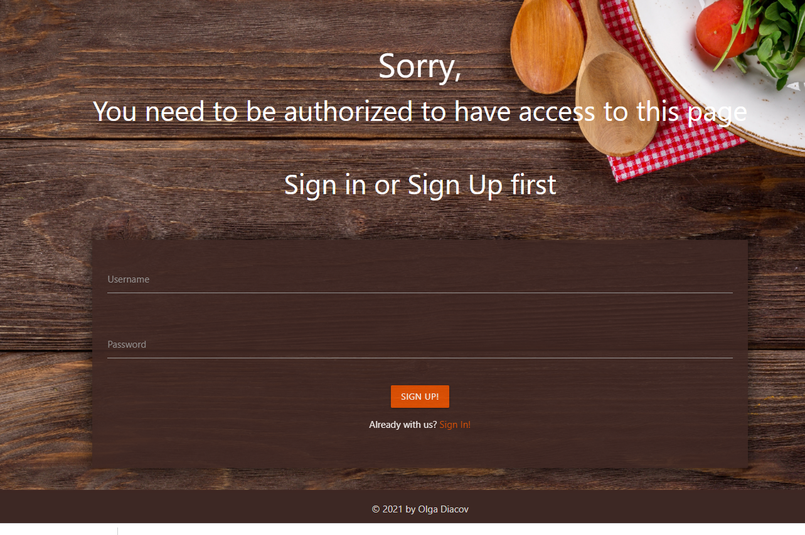
3. The "View recipes" button redirects logged-in user to the "Recipe" page.

- Sign-in/ Sign-up links on the navbar
1. When hitting them, the user is redirected to a separate page with the fill in form: "username","password"
2. If when siginin-up the user name already exists, user will get the flash message.
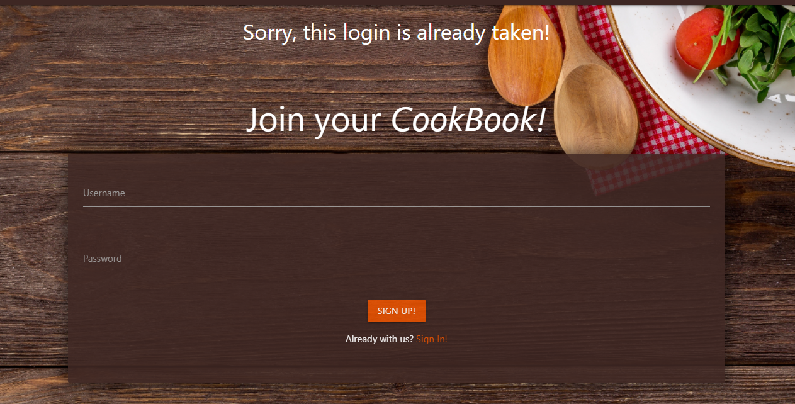
3. If the user did not fill in an input field a red line will appear.
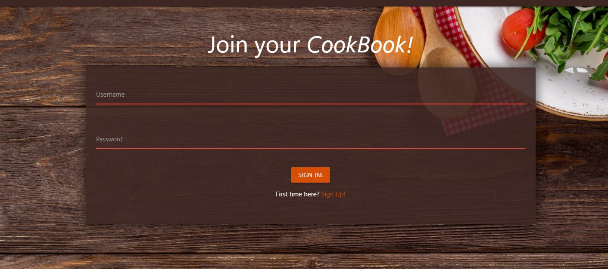
4. If the user wants to sign-up/sign-in without filling in the form, they will see the reminder to do that in the input fields.
5. Redirect users to "My Page" with a greeting and buttons "create your recipe"/"view all recipes"
2. "create your recipe" leads to the form for creating a recipe
3. "view all recipes" leads to the page with all displayed recipes

- "Create your recipe" from "Mypage"
1. A validated form appears.
2. If the user did not fill in an input field a red line will appear, otherwise the green line will shoe that everything is correct.
3. A drop down menu for choosing category appears.
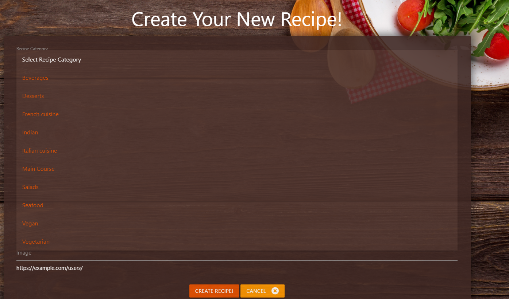
4. User provides a link to load the image in the indicated format.
5. If the image cannot be loaded, user will see the default image with the text "Try again". 
6. Button "create recipe" leads to the "Recipes" page.
7. Button "cancel" allows to go back to the "Recipes" page.

- "New Recipe" on the navbar
1. Redirects to the "Create your recipe" form with all the funcionality mentioned above.
2. When the recipe is created, a flash success message appears.
3. New recipe appears first in the list.

- "Recipes" page
1. All recipes are displayed.
2. Logged-in users sees all recipes but sees "delete"/"edit" buttons only on his/her recipes
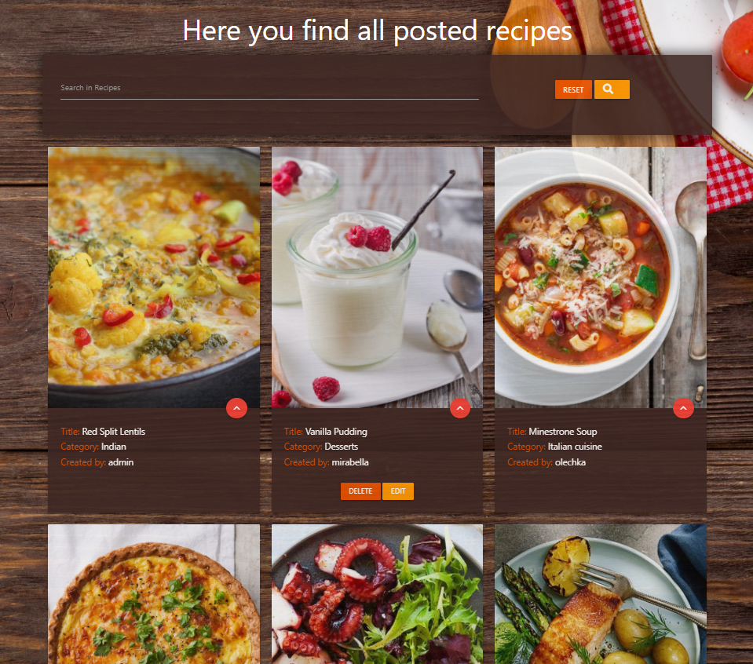
3. "delete" button deletes the recipe and leaves the user on the same page.
4. "edit" button redirects to the "Edit your recipe" form with the populated fields.
5. After hitting the "edit" button the user is redirected to the "Recipes" page and sees a susscess flash message. 

- Recipes cards with the image on the "Recipes" page
1. User hitts the red circle button and sees the card reveal opened with the detailed recipe description.

2. To close the reveal user hits the red circle button on the top left.
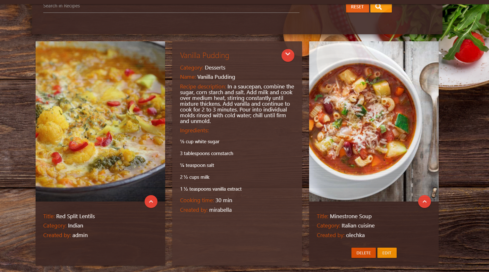

- Search option on the "Recipes" page
1. User enters any word from the name/description/ingredients/category of any recipe displayed and sees the selected results.
2. User can reset the search with the "reset" button.

- Sign Out
1. When sign out, the user sees the sig-in/sign up form again with the flash message "See you soon".

- Logged-n as Admin
1. Admin is redirected to his/her profile page with the same functionality
2. Admin sees "Manage Categories" link on the navbar.
3. When hits the "Manage Categories", Admin is redirected to the separate page with Categories.
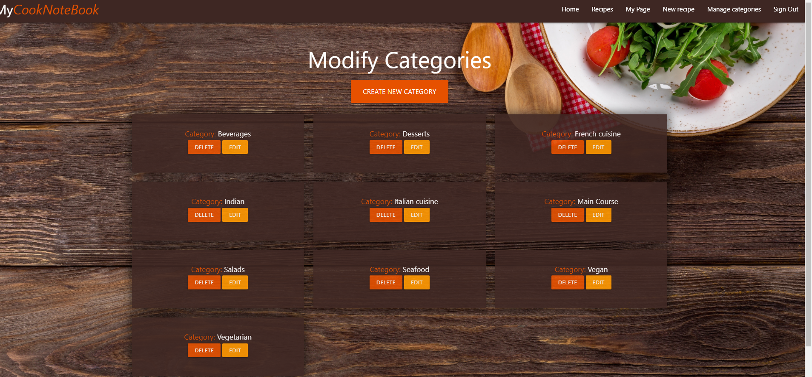
4. There is "Create new category" button on the top, which redirects to an validated input field with "create new category"/"cancel" buttons.
5. "cancel" cleans up the input field.
6. If the field is empty, when hitting the "create new category" button a reminder in the input field will appear as well as the red line.
7. "create new category" button redirects again to the "Manage categories" page, with the flash success message.
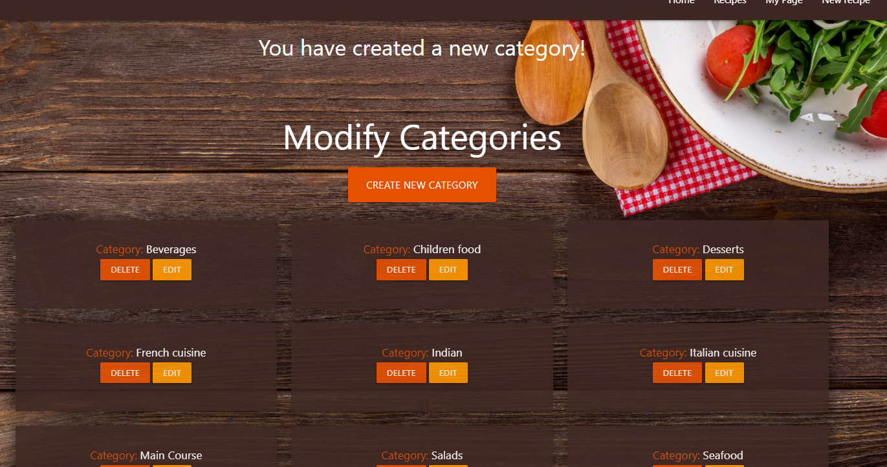
8. Categories have "delete"/"edit" buttons.
9. "Edit" button redirects again to the form with one populated input field.
10. Admin can cancel editing.
9. Admin can succsessful delete the category (a success flash message will appear).
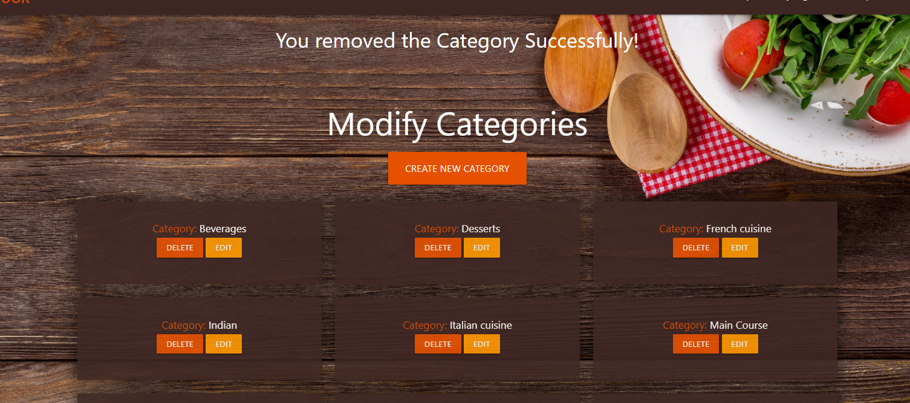

- Non-logged-in/logged-in users testing
1. If a non-logged-in user tries to access the "Recipes"/"New recipe"/"Search"/"My page" pages in the browser by the route name, a custom page with "Sorry" message and registration form will appear.

2. If a non-logged-in/logged-in user tries to access the "Manage categories"/"Add category" pages in the browser by the route name, a custom page with "Sorry, you need to be authorized as Admin to access this page" message will appear.
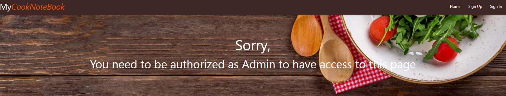
3. If a non-logged-in/logged-in user tries to access the "Edit recipe"/"Delete recipe"/"Edit category"/"Delete category" in the browser by the route name, an error message in the browser will appear.

- Sign-out link on the navbar
1. When signed-out the user sees the flash message "See you soon" and the sign-in/sign-up form.
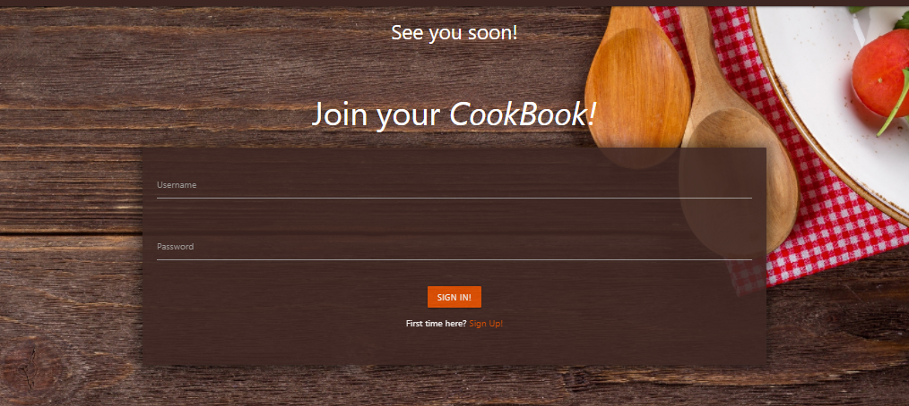

# Testing User Stories from User Experience (UX) Section  

## General Users
-	As a general user, I want to easily understand the main purpose of the application due to the clear layout.  
1. The application includes elements and features for the clear purpose understanding:   
a. navigation bar with the logo and all necessary links for the best navigation  
b. interactive forms for creating/editing/ deleting recipes  
c. user’s profile with possibility to be redirected to the recipe creation or veiwing all recipes.  
d. buttons for the better interaction and executing any needed action.  
e. search option to easily find any needed recipe.  
f. a clear and simple layout for managing categories for Admin.  
g. text content including calls to action, flash messages on executed actions.  

-	As a general c user, I want to be able to intuitively navigate through the application.  
a.	navigation bar with the logo and all necessary links for the best navigation  
b.	interactive forms for creating/editing/ deleting recipes  
c.	user’s profile with possibility to be redirected to the recipe creation or veiwing all recipes.  
d.	buttons for the better interaction and executing any needed action.  
e.	search option to easily find any needed recipe.  
f.	a clear and simple layout for managing categories for Admin.  
g.	text content including calls to action, flash messages on executed actions.  

-	As a general user, I want the application be responsive on all devices.    
a. Application is responsive on all kinds of devices  

-	As a general user, I want to be able to use the application on any device.     
a. It is easy to use the Application on all kinds of devices due to its laconic and clear layout.  

-	As a general user, I want to be able to navigate the application from any kind of devices.         
a. the mobile version of the application provides a comfortably to use mobile side navigation bar (by Materialize)

## Non logged-in/ Non-registered Users
-	As a non-logged-in user, who is a food or cook lover, I want to easily understand the main purpose of the applcation, which is providing the possibility to write down favorite recipes with quick notes as well as to manage recipes: create, update, delete.    
a. It is easy to understand due to the Home page with the brief project description.

-	As a non-logged-in user, I want to easily understand how i can start using the application. (By SignUp/SignIn function on the home page).      
a. It is easy to understand due to the Home page with the SignUp/SignIn links on the navigation bar.  
b. After clicking on the SignUp/SignIn an intuitively clear validated form will appear offering to fill in the User name and Password.

-	As a non-registered user, I want to easily sign up in order to start using the application.  
a. It is easy to accomplish due to the SignUp link on the navigation bar.  
b. After clicking on the SignUp link an intuitively clear validated form will appear offering to fill in the User name and Password.

## Logged-in Users
-	As a logged-in user I want to be redirected to my Profile page where i am greeted as a User and from where I can create new recipes or have a quick access to the all recipes page.   
a. After signing in/signing up the User is redirected to “My page”.  
b. Here user can use the “Create recipe” or “View all recipes” buttons to choose the needed action.

-   As a logged-in user, I want to easily find out how i can put quick notes of a new recipe.   
a. It is easy to do through navbar link “New recipe” or by hitting the button “Create your recipe” on “My page”.  

-	As a logged-in user, I want to easily get any recipe or category by search option.  
a. There is a search option on the “Recipes” page, where user can find posted recipes by key words (recipe name, category name, ingredients).

-	As a logged-in user, I want to easily find out what kind of the recipe information I can write down.   
a. A validated form will intuitively guide users by its fileds: Category, Recipe Name, Description, Ingredients, Cooking time, loading image input).

-	As a logged-in user, I want to create a recipe record in the easiest way.  
a. A validated form will intuitively guide users by its fileds: Category, Recipe Name, Description, Ingredients, Cooking time, loading image input).  
b. The dropdown option for choosing category is provided.  

-	As a logged-in user, I want to easily cancel adding the Recipe.   
a. The button cancel below the Create recipe form is provided.

-	As a logged-in user, I want to upload a recipe image to remember how it looks like a. The form is provided with the input field for the image link.  
b. As an example for the users’ convenience it is shown how the link should look like.
 
-	As a logged-in user, I want to easily find out how to edit or delete the Recipe.  
a. Each recipy card with the recipe description is provided with edit/delete button.  
b. When the action is completed successfulle, the user will be notified with the flash messages.

-	As a logged-in user, I want to easily cancel editing the Recipe.  
a. While editing, the user can see the “Cancel” button below the “Edit Recipe” form.

-	As a logged-in user, I want to have basic food categories to where i can allocate my recipes.  
a. The User can choose already set by Admin categories from the drop down menu in the “Create Recipe” form.

-	As a logged-in user, I do not want anyone, except Admin, to manage my recipes.  
a. Only recipes Authors can manage their recipes. The buttons edit/delete are not displayed for non-authors.

## Admin
-	As an Admin, I want to easily sign-in to the website.  
a. It is easy to understand due to the Home page with SignIn link on the navigation bar.  
b. After clicking on the SignIn an intuitively clear validated form will appear offering to fill in the User name and Password.

-	As an Admin, I want to have access for editing/deleting any created recipe of any user.   
a. Admin has access to manage recipes of any user: the buttons “edit”/”delet” are always displaed for Admin below the recipes cards on the “Recipes” page.

-	As an Admin, I want to to have access to the recipes categories with the possibility to manage them (add, edit, delete).  
a. Admin has access to manage recipes’ categories through the Navigation bar by hitting the “Manage Categories” link.  
b. The possibility to manage categories is provided by the buttons ”Create category” above all categories and “edit”/”delete” buttons, which are always displaed for Admin.

-	As an Admin, I want the recipes Authors to be able to manage only their own recipes.  
a. Only recipes Authors can manage their recipes. The buttons edit/delete are not displayed for non-authors.

-	As an Admin I do not want to showcase all the created recipes to non-logged in users.   
a. The non-logged Users do not have access to view all recipes. After hitting the button “View recipes” on the Home page, they are redirected to the page with a “Sorry” message and are offered to sign-in/sign-up first in the displayed form.
 
-	As an Admin I want to limitate non-logged in users from having access to the:   
a. vewing/managing all recipes  
b. having search option     
c. managing categories  
d. having access to their or other users profiles  

In all these cases the non-logged in User will be redirected to customized error-handlers pages with the respective messages and further guidance.

  

# Deployment

The CookNoteBook application project was created on Gitpod.   
All commits to git pushed the project to the GitHub repository. The deployment was executed to Heroku to see the live site.   
The pushes to GitHub automatically pushed to Heroku to update the live site.  

### Running CookNoteBook application project Online Locally

# GitHub

## Cloning the project from GitHub
The project will only run locally if an env.py file is set up with the IP, PORT, SECRET_KEY, MONGO-URI and MONGO_DBNAME. In order to secure sensitive information these details can not be shared on this documentation. The env.py file should be added to your gitignore file.  
1.	Navigate to Diolg/cook-book
2.	Click on the green Code button
3.	Select the code dropdown button beside the Gitpod button
4.	Copy the URL listed.
5.	Start up your IDE and navigate to the file location.
6.	To clone, copy this code and input it into your terminal:
(https://github.com/Diolg/cook-book)  

## Forking the GitHub Repository
By forking the GitHub Repository we make a copy of the original repository on our GitHub account to view and/or make changes without affecting the original repository by using the following steps:
1.	Log in to GitHub and locate the [GitHub Repository](https://github.com/Diolg/cook-book)
2.	At the top-right of the page, just below the GitHub navigation bar, the "Fork" Button is located.
3.	Click the “Fork” button and get a copy of the original repository to a GitHub account.

# Heroku

## Deployment to Heroku

### Create the application:
- Login in to heroku.com
- Click on New, and Create new app
- Enter your app name
- Select the region that is closest to you

### Connect to you GitHub repository
-	Click Deploy and select GitHub - Connect to GitHub
-	Enter your repository name and search
-	Click Connect on the correct repository  

### Set Your Environment Variables

### Go to settings, and within Config Vars enter the following
-	IP: 0.0.0.0
-	PORT: 5000
-	MONGO_DBNAME: (enter the database name that you are connecting to)  
-	MONGO_URI: (enter your mongo uri. This is found by going to clusters> connect> connect to your application and entering your passwords and dbname within the link)  
-	SECRET_KEY: (This is a secret password that must be very secure.)  

### Enable Automatic Deploys

-	Go to the deploy tab  
-	Within the automatic deploys section, choose the branch that you want to deploy from and select Enable Automatic Deploys. 
  

# Credits

## Code
-	[Materialize 1.0.0]( https://materializecss.com/)
Materialize Library was used to make a responsive navigation bar, footer and throughout the project to make website responsive.
-	A lot of hints were found on [CSS-tricks]( https://css-tricks.com/), [W3schools](https://www.w3schools.com/), [Stackoverflow](https://stackoverflow.com/)
-	To get some more information on setting users log in system i used the tutorial of: [Luke Peters](https://www.youtube.com/watch?v=w1STSSumoVk)
-	The biggest support for this project has become the Task Manager Mini Project, provided by the Code Institute, including the JS code for the forms validation. 

## Content  

-   All text content was created by developer.
-   The recipes descroption was taken for the demonstration purposes from [Allrecipes](https://www.allrecipes.com/)

## Media  

-   The background image: [Pexels](https://www.pexels.com/photo/table-on-wooden-plank-326279/)
-   The URL for recipes' images were taken from different sources just for demonstration purposes.  
-   The default image when the users' image cannot be loaded, was created by application developer.

